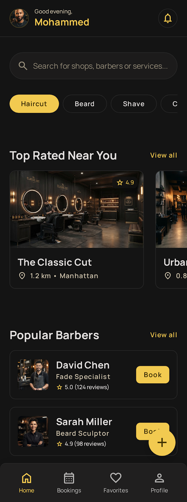
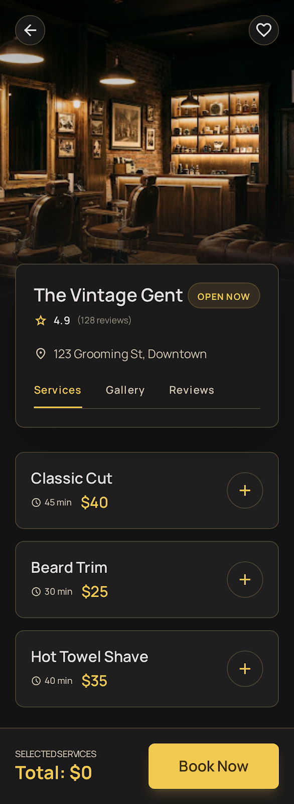
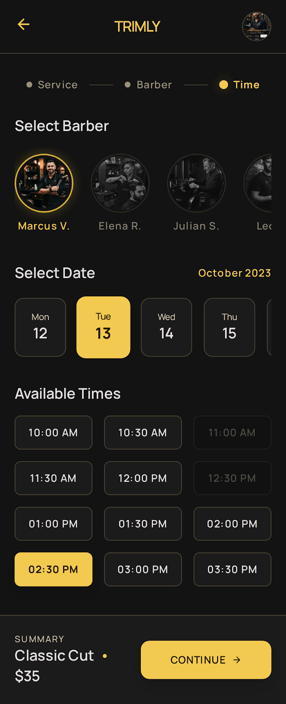
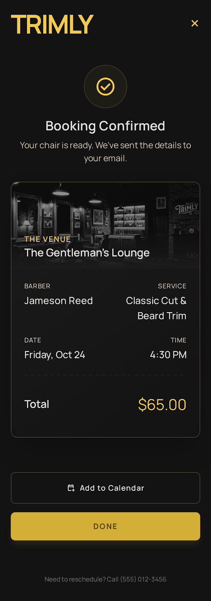
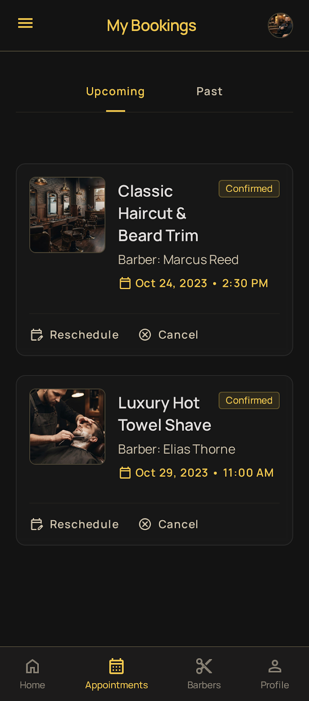
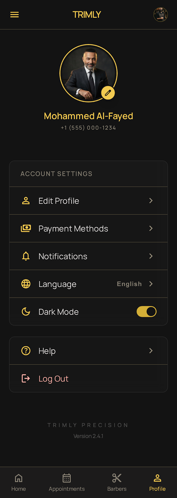

<div align="center">


# Trimly

**A premium barber booking experience.**

*Noir Luxe design · Feature-first Clean Architecture · Riverpod*


</div>

---

## About

Trimly is a dark-mode barbershop booking app built around an exclusive
grooming-lounge aesthetic — deep charcoal surfaces, warm gold accents and
Manrope typography. The full journey works end to end: onboard, sign in,
browse shops, pick services, choose a barber and time slot, confirm, then
manage bookings from a receipt-style history.

The data layer is mock-backed but architected like production: repository
interfaces in the domain layer, simulated network latency, and local
persistence — swapping in Firebase or a REST API later touches nothing in
the presentation layer.

## Features

- **Onboarding & auth** — full-bleed photography carousel, validated
  sign-in/sign-up with persisted sessions and a mock Google flow
- **Home** — live search across shops, barbers and services; category
  filter chips; "Top Rated Near You" rail; popular barbers with quick Book
- **Favorites** — toggleable hearts persisted across sessions, with a
  dedicated tab
- **Shop detail** — hero-animated photo header, Services / Gallery /
  Reviews tabs, multi-select services with a running total in a sticky
  booking bar
- **Booking flow** — barber picker with gold selection ring, 7-day date
  strip, half-hour slot grid with realistic unavailability, receipt-style
  confirmation with dashed divider
- **My Bookings** — Upcoming/Past segmented control, reschedule (prefilled
  flow), cancel with confirmation, tap-to-rate past visits, Book Again
- **Profile** — editable persisted profile, grouped settings, log out
- **Polish** — shimmer skeleton loading, staggered list entrances,
  fade-through page transitions, designed empty states

## Screens

| Splash | Onboarding | Login |
|:---:|:---:|:---:|
|  |  |  |

| Home | Shop Detail | Booking |
|:---:|:---:|:---:|
|  |  |  |

| Confirmation | My Bookings | Profile |
|:---:|:---:|:---:|
|  |  |  |

## Architecture

Feature-first Clean Architecture: each feature owns its `domain`
(entities + repository interfaces), `data` (mock implementations) and
`presentation` (screens, widgets, Riverpod providers). Cross-cutting
concerns live in `core`.

```
lib/
├── core/
│   ├── constants/        # spacing grid, asset paths
│   ├── providers/        # shared_preferences injection
│   ├── router/           # go_router config + fade-through transitions
│   ├── theme/            # AppColors, AppTextStyles, ThemeData (single source of truth)
│   ├── utils/            # simulated latency
│   └── widgets/          # PrimaryButton, GhostButton, AppCard, chips, skeletons…
└── features/
    ├── auth/             # session, login, signup
    ├── bookings/         # booking flow, confirmation, history, time slots
    ├── favorites/        # persisted favorites
    ├── onboarding/
    ├── profile/
    ├── shell/            # bottom-nav StatefulShellRoute scaffold
    ├── shops/            # catalogue, home, detail, seed data
    └── splash/
```

**Key decisions**

- **Repositories as interfaces** — `AuthRepository`, `ShopRepository` and
  `BookingRepository` are abstract; mock implementations add 300–600ms of
  simulated latency and persist through `shared_preferences`
- **Riverpod everywhere** — app state lives in providers
  (`AsyncNotifier` controllers, derived `Provider`s for filtering); widgets
  stay declarative
- **Deterministic slot engine** — availability is generated from a stable
  FNV-1a hash per shop/barber/slot, so a "taken" slot stays taken across
  sessions and is unit-testable
- **Design tokens in one place** — every color, text style and radius comes
  from `core/theme`; widgets never hardcode values

## Tech Stack

| Layer | Choice |
|---|---|
| Framework | Flutter (Material 3, dark theme) |
| State | flutter_riverpod |
| Navigation | go_router (`StatefulShellRoute` bottom nav) |
| Typography | Manrope via google_fonts |
| Persistence | shared_preferences |
| Formatting | intl |

## Getting Started

```bash
git clone https://github.com/mohammedashi11/Trimly.git
cd Trimly
flutter pub get
flutter run
```

Sign in with any well-formed email and a 6+ character password — the mock
auth accepts it and persists your session.

## Tests

```bash
flutter test      # 21 tests: domain logic + widget coverage
flutter analyze   # zero issues
```

- Unit tests: booking price/duration totals, serialization round-trips,
  slot-grid generation and determinism
- Widget tests: home search & category filtering, shop detail selection and
  tabs, the full booking flow through to persisted confirmation

## Design

The `design/` folder is the source of truth: per-screen mockups
(`screen.png` + `code.html`) and the full design system in
[`design/trimly/DESIGN.md`](design/trimly/DESIGN.md) — the "Noir Luxe"
palette (#141414 charcoal, #F2CA50 gold), Manrope type scale, 8px spacing
grid, 16px radii and tonal-layering elevation rules the app implements.
